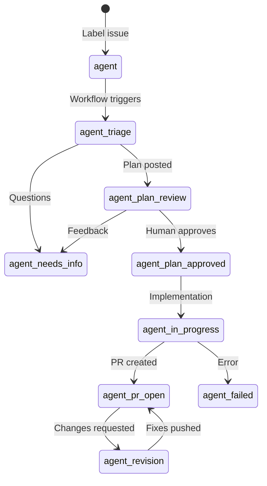
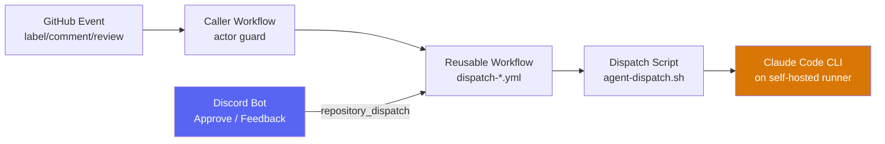

# Plan C: Slidev Deck & Speaker Notes

> **For agentic workers:** REQUIRED SUB-SKILL: Use superpowers:subagent-driven-development (recommended) or superpowers:executing-plans to implement this plan task-by-task. Steps use checkbox (`- [ ]`) syntax for tracking.

**Goal:** Build a Slidev presentation deck and companion speaker notes document for the April 2, 2026 presentation "Claude Agent Dispatch: An Open-Source Agent Orchestrator Built on GitHub Actions."

**Architecture:** Slidev project with a single `slides.md` containing all slides in Markdown with Mermaid diagrams. Speaker notes embedded per-slide using Slidev's `<!-- notes -->` syntax. A separate `speaker-notes.md` file with expanded talking points, scenario narratives, and Q&A ammunition.

**Tech Stack:** Node.js, Slidev, Mermaid (built into Slidev)

**Machine:** Windows — needs Node.js 18+ installed. Present from browser.

**Prerequisites:**
- Node.js 18+ installed (`node --version`)
- npm or pnpm available
- Design spec: `docs/superpowers/specs/2026-03-26-presentation-demo-design.md` in the claude-agent-dispatch repo (branch `presentation/demo-prep`)

**Key context from the spec:**
- 30-minute talk including Q&A to engineers familiar with GitHub Actions and Claude Code
- ~13 slides covering: title, problem, vision, label state machine, architecture, safety, alternatives comparison, demo transition, cross-project transition, getting started, open source plug
- Three-column comparison table: Copilot Coding Agent vs OpenClaw vs Claude Agent Dispatch
- Non-affiliation disclaimer on title slide

---

## File Structure

```
presentation/
├── package.json
├── slides.md              # All slides (Slidev format)
├── speaker-notes.md       # Expanded talking points and Q&A prep
└── public/
    └── (any images/screenshots added later)
```

This will live in a standalone directory (not inside the demo repos). Could be in `~/presentation/` or a dedicated repo.

---

### Task 1: Initialize the Slidev project

**Files:**
- Create: `presentation/package.json`
- Create: `presentation/slides.md` (starter)

- [ ] **Step 1: Create the project directory and initialize Slidev**

```bash
mkdir -p ~/presentation
cd ~/presentation
npm init slidev@latest -- --theme default
```

When prompted, accept defaults. This creates the project with a starter `slides.md`.

- [ ] **Step 2: Verify Slidev runs**

```bash
cd ~/presentation
npm run dev
```

Visit `http://localhost:3030` — you should see the default Slidev presentation. Press `Ctrl+C` to stop.

- [ ] **Step 3: Commit**

```bash
cd ~/presentation
git init
git add -A
git commit -m "feat: initialize Slidev presentation project"
```

---

### Task 2: Build the slide deck

**Files:**
- Modify: `presentation/slides.md`

- [ ] **Step 1: Replace slides.md with the full presentation**

Replace the contents of `presentation/slides.md` with:

````markdown
---
theme: default
title: "Claude Agent Dispatch"
info: |
  An Open-Source Agent Orchestrator Built on GitHub Actions
class: text-center
drawings:
  persist: false
transition: slide-left
mdc: true
---

# Claude Agent Dispatch

## An Open-Source Agent Orchestrator Built on GitHub Actions

<div class="mt-8 text-sm opacity-75">

github.com/jnurre64/claude-agent-dispatch

</div>

<div class="mt-4 text-xs opacity-50">

This is an independent open-source project, not affiliated with or endorsed by Anthropic.

</div>

<!--
Welcome everyone. Today I'm going to show you a system we built for running Claude Code agents autonomously on GitHub issues. Instead of manually shepherding Claude through each task, the system manages the full lifecycle — from issue triage to pull request — with human approval gates at key checkpoints. [Presenter name, role]
-->

---

# The Problem

<v-clicks>

- **The babysitting problem** — Paste context, wait, review, approve, wait, check in...
- **The overnight backlog** — Three bugs come in at 2am; you wake up to issues, not PRs
- **The scale problem** — Claude is great for one task. What about twenty?

</v-clicks>

<!--
Three scenarios that might be familiar. [Expand on whichever resonates — see speaker notes for full narratives.]
-->

---

# What If?

<div class="text-2xl mt-12 leading-relaxed">

A system that **triages**, **plans**, gets **approval**, **implements**, and handles **review feedback** — autonomously, on any project.

</div>

<!--
That's what we built. Let me show you how it works.
-->

---

# Label State Machine



<!--
The core of the system is a label state machine on GitHub issues. Each label represents a stage in the lifecycle. The key transition is plan-review to plan-approved — that's the human checkpoint. No code gets written until a human approves the plan.
-->

---

# Architecture



<!--
The event flow: a GitHub event triggers a workflow, which calls the dispatch script, which invokes Claude Code on your self-hosted runner. The Discord bot is a separate entry point — when you approve from Discord, it fires a repository_dispatch event that bypasses the actor guard. Your code never leaves your infrastructure.
-->

---

# Safety & Guardrails

<v-clicks>

- **Two-phase approval** — Human reviews plan before any code is written
- **Circuit breaker** — Halts after 8 bot comments/hour per issue
- **Tool restrictions** — Read-only for triage, read-write for implementation
- **Actor filter** — Bot's own actions don't re-trigger workflows
- **Concurrency groups** — One agent job at a time per issue
- **Timeouts** — Configurable per-job (default: 125 min)

</v-clicks>

<!--
Safety is not an afterthought. The two-phase approval is the most important one — no code gets written without a human saying "go." The circuit breaker prevents runaway loops. Tool restrictions mean the agent can't sudo, can't force push, can't access the network during triage.
-->

---

# How Is This Different?

| | Copilot Agent | OpenClaw | Agent Dispatch |
|---|---|---|---|
| **Type** | GitHub built-in | AI assistant platform | Issue-to-PR orchestrator |
| **Open source** | No | Yes | Yes |
| **Self-hosted** | No | Yes | Yes |
| **Auth model** | Premium requests | Any LLM API | Claude Pro/Max sub |
| **Approval gate** | No | N/A | First-class |
| **Complexity** | Low (built-in) | High (24+ channels) | Low (scripts + Actions) |
| **Data sovereignty** | GitHub infra | Your infra | Your infra |

<!--
Three tools you might compare this to. Copilot Agent is built into GitHub but it's a black box — no self-hosting, no customization, no approval gate. OpenClaw is a massive personal assistant platform — 250k stars, 24 messaging channels — but it's not purpose-built for coding workflows. Agent Dispatch is focused: issue goes in, PR comes out, with human checkpoints. It also uses your existing Claude subscription, not per-token API billing.
-->

---
layout: center
class: text-center
---

# Demo Time

Let's see it in action.

<!--
I'm going to show you the full lifecycle on a .NET recipe manager app. I'll kick off a real agent job, then walk through pre-staged examples of each stage so we don't have to wait for the agent to finish.
-->

---
layout: center
class: text-center
---

# Same System, Different Project

Zero code changes to the dispatch configuration.

<!--
Now let me show you the same system on a completely different project — a Godot game. Same agent-dispatch config, different tech stack.
-->

---

# Getting Started

```bash
# 1. Clone the dispatch system
git clone https://github.com/jnurre64/claude-agent-dispatch.git ~/agent-infra

# 2. Open Claude Code
cd ~/agent-infra && claude

# 3. Run the setup skill
/setup
```

**Two modes:**
- **Reference** — calls upstream workflows via `@v1`, auto-updates
- **Standalone** — full control, all files in your repo

<!--
Three commands to get started. The /setup skill walks you through everything interactively — picks your mode, configures the bot account, generates workflows, and guides you through setting secrets. Takes about 5 minutes.
-->

---
layout: center
---

# Open Source

<div class="text-xl">

**github.com/jnurre64/claude-agent-dispatch**

</div>

<div class="mt-8 text-lg">

**Coming next:** Slack integration, channel-based architecture

**Built with:** Shell, GitHub Actions, Python (Discord bot)

**License:** MIT

</div>

<div class="mt-8">

Questions?

</div>

<!--
The repo is MIT licensed and we'd love contributions. If you have ideas, open an issue. If you want to try it, /setup gets you running in 5 minutes. The Discord bot we showed today was built in the last week — there's a lot of room to grow. Thank you, I'm happy to take questions.
-->
````

- [ ] **Step 2: Verify slides render correctly**

```bash
cd ~/presentation
npm run dev
```

Visit `http://localhost:3030` and click through all slides. Verify:
- Mermaid diagrams render
- `v-clicks` animate on click
- Speaker notes visible in presenter mode (press `p` to enter presenter view)
- Table on the comparison slide is readable

- [ ] **Step 3: Commit**

```bash
git add -A
git commit -m "feat: add complete slide deck"
```

---

### Task 3: Create the speaker notes document

**Files:**
- Create: `presentation/speaker-notes.md`

- [ ] **Step 1: Create the speaker notes file**

Create `presentation/speaker-notes.md`:

```markdown
# Speaker Notes & Talking Points

Companion document for the Claude Agent Dispatch presentation.
Expanded talking points, scenario narratives, and Q&A preparation.

---

## Slide 2: The Problem — Expanded Scenarios

### The Babysitting Problem
"How many of you have used Claude Code on a task? Great. Now think about what that workflow looks like. You open an issue, copy the context, open Claude, paste it in, maybe add some instructions. Claude starts working. You wait. It produces a plan. You read it, give feedback. It revises. You approve. It starts coding. You check in periodically. It finishes, you review the diff, maybe ask for changes. That's 20-30 minutes of your attention for a single issue. Now imagine doing that for five issues. Or ten. You become a babysitter, not an engineer."

### The Overnight Backlog
"Picture this: it's Friday evening. Three bug reports come in over the weekend. On Monday morning, you have three issues sitting there, waiting for someone to start investigating. What if instead, you woke up Monday to three pull requests — each one triaged, planned, implemented, and ready for your review? That's what this system does."

### The Scale Problem
"Claude Code is phenomenal for focused, one-on-one tasks. But it's a single-threaded tool — you're the orchestrator. What happens when you have a backlog of twenty issues and you're the only engineer? You can't clone yourself, but you can set up a system that works through those issues autonomously while you focus on the ones that need human judgment."

---

## Slide 4: Label State Machine — Key Points

- Emphasize that **each label is visible in GitHub's UI** — managers, PMs, and teammates can see exactly where every issue is in the pipeline without opening the issue.
- The key transition is `plan-review → plan-approved` — **this is where the human makes the call.** No code is written until this gate is passed.
- `agent:needs-info` can happen at two stages: during triage (agent asks clarifying questions) and during plan review (human gives feedback on the plan).
- The state machine is **not configurable** by design — it enforces a consistent lifecycle across all projects.

---

## Slide 5: Architecture — Key Points

- **Self-hosted runners** mean your code never leaves your machine. For companies with IP concerns, this is critical.
- The **Discord bot** is a recent addition — it fires `repository_dispatch` events that bypass the actor guard. This was built specifically so you can approve a plan from your phone.
- The **dispatch script** is the brain — it's a shell script (~500 lines across modules) that manages worktrees, fetches debug data, invokes Claude with the right tools and prompts, and handles the lifecycle transitions.
- All of this runs on **standard GitHub Actions** — no custom runtime, no SaaS dependency.

---

## Slide 7: Alternatives — Q&A Ammunition

### "Why not just use Copilot Coding Agent?"
Copilot Agent is great if you're fully in the GitHub ecosystem and don't need customization. But it's a black box — you can't customize the agent's prompts, you can't add project-specific tools, you can't control which model it uses, and there's no human approval gate before it starts writing code. Also, it runs on GitHub's infrastructure, so your code is being processed on their servers. If you need data sovereignty or customization, you need something else.

### "What about OpenClaw?"
OpenClaw is a general-purpose AI assistant platform — think "AI butler" not "AI developer." It has 24+ messaging channels, 13,000+ skills, voice capabilities, calendar integration. It CAN do GitHub tasks through a skill add-on, but coding is not its primary purpose. It's also a complex system to set up and maintain for what is ultimately a simple workflow: issue goes in, PR comes out. Also worth noting — it was originally called "Clawdbot" and had to rename due to Anthropic trademark issues, which tells you something about its relationship with the ecosystem.

### "What about Devin?"
Devin is impressive but it's closed-source SaaS at $20-500/month. Your code goes to Cognition's servers. You have zero visibility into how the agent works, no ability to customize its behavior, and no option to self-host. For companies with IP sensitivity, that's a non-starter. For individual developers, it's expensive for what you get.

### "What about Open SWE (LangChain)?"
Open SWE is actually the closest open-source competitor — it's label-triggered from GitHub issues, it plans, codes, and opens PRs. The key differences: it's tightly coupled to the LangGraph/LangChain ecosystem (which is a significant dependency), it has no built-in human approval gate before implementation, and it requires cloud sandboxes (Daytona) for execution rather than your own runners.

### "What about SWE-agent?"
SWE-agent is a research tool for benchmarks, not a production deployment system. It's a one-shot solver — you give it an issue, it tries to produce a patch. There's no lifecycle management, no triage, no plan review, no notification system. Great for research; not great for running autonomously on your team's issues.

### "Why not just use claude-code-action?"
claude-code-action is Anthropic's official GitHub Action and it's excellent for quick PR interactions — @claude mentions, one-off reviews, simple fixes. The difference is lifecycle. claude-code-action is stateless — each invocation is fresh. Agent Dispatch manages a multi-phase lifecycle with persistent state (worktrees, labels), human checkpoints, and a notification layer. Think of claude-code-action as "ask Claude a question" and Agent Dispatch as "assign Claude a project."

---

## Demo Transitions

### Slides → Demo
"Alright, enough slides. Let me show you this in action. I'm going to switch to my browser where I have the recipe manager app running, GitHub open, and Discord ready."

### Cooking Show Pivot
"While that's running — and you can see the workflow active in the Actions tab — let me show you what the next stage looks like. I've got another issue here that's already been through triage..."

### Demo → Godot
"So that's the full lifecycle on a .NET web app. Now here's the fun part — let me switch to a completely different project. This is dodge the creeps, a Godot game..."

### Godot → Setup
"Same dispatch system, zero changes needed. Now the question you're probably asking: how do I set this up? Let me show you."

### Demo → Closing Slides
"That's the setup flow. Takes about 5 minutes to go through the full thing. Let me go back to the slides for a quick wrap-up."

---

## Fallback Pivot Lines

If a live demo step fails:

- **Workflow doesn't trigger:** "Looks like the runner is busy — let me show you what this normally produces." (Switch to pre-staged result.)
- **Discord notification doesn't arrive:** "Discord can sometimes take a moment — while we wait, let me jump ahead to show you..." (Move to next pre-staged issue.)
- **App doesn't load:** "Let me pull up a screenshot of this." (Switch to fallback backup slide.)
- **General failure:** "Live demos, right? Let me show you a recording of this exact flow I ran earlier." (Switch to backup recording if available.)

---

## Time Checkpoints

| Checkpoint | Target Time | What to cut if behind |
|---|---|---|
| End of slides, start demo | 8:00 | Shorten alternatives slide — hit highlights only |
| Finish main demo | 20:00 | Skip the "check back on triage" step (step 14) |
| Finish Godot cameo | 22:00 | Cut setup speed run entirely |
| Finish setup speed run | 24:00 | N/A — proceed to closing |
| Start Q&A | 25:00 | |
```

- [ ] **Step 2: Commit**

```bash
git add -A
git commit -m "feat: add speaker notes with talking points and Q&A prep"
```

---

### Task 4: Final verification

- [ ] **Step 1: Run Slidev and verify full presentation**

```bash
cd ~/presentation
npm run dev
```

Click through every slide. Enter presenter mode (`p`) and verify speaker notes are visible. Check that Mermaid diagrams render correctly.

- [ ] **Step 2: Test presenter mode workflow**

In presenter mode, verify:
- Speaker notes are readable
- Timer is visible
- Slide transitions work
- `v-clicks` animations work on the Problem and Safety slides

- [ ] **Step 3: Commit final state**

```bash
git add -A
git commit -m "chore: final verification pass"
```
